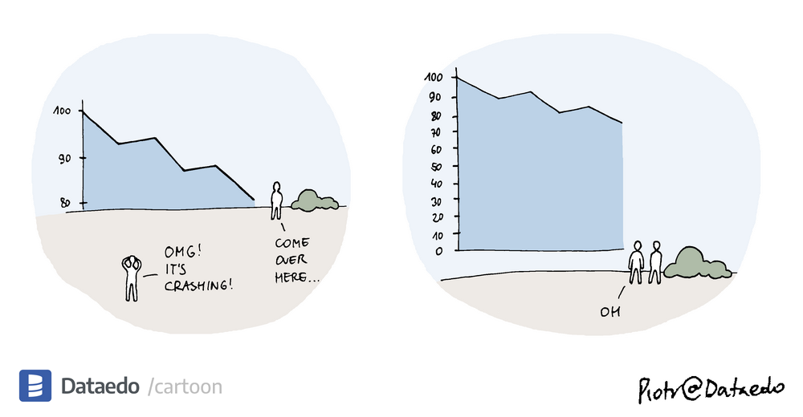

```{=html}
<div class="header page-header">
  <div class="subtitle">Assitant Professor. Researcher.</div>
  <h1>Diogo F. Soares</h1>
  
</div>
```

::: {.content-page}

::: {.page-heading-row}
[<ion-icon name="arrow-back-outline"></ion-icon>](teaching.html){.back-home aria-label="Back to teaching"}

# Data Visualization 2026/27 {.page-title}
:::

{.course-cartoon}

::: {.content-card}
## Objectives

::: {.course-introduction}
The course aims to provide students with the fundamental concepts and practical skills required to use Data Visualization and Visual Analytics as part of the data analysis process. By the end of the course, students should be able to:
:::

::: {.course-objectives}
1. Understand the role of visualization in data exploration, analysis, and communication.
2. Characterize data according to its structure, attribute types, and analytical context.
3. Formulate analytical questions and translate them into appropriate visualization tasks.
4. Prepare and transform data to support effective visual analysis.
5. Design and use interactive visualizations and analytical dashboards.
6. Apply Visual Analytics techniques to exploratory and multivariate data analysis and pattern discovery.
7. Analyze relational, temporal, geospatial, and spatio-temporal data through appropriate visual techniques.
8. Integrate visualization with computational methods, including dimensionality reduction, clustering, and machine learning.
9. Critically evaluate visualizations and use them to support data-driven reasoning and decision-making.
:::
:::

::: {.content-card}
## Topics

::: {.course-topics}
1. Introduction to Data Visualization and Visual Analytics
2. Data types, structures, and characteristics for visualization
3. Analytical questions and task abstraction
4. Visual representation: marks, channels, and visual encoding
5. Data preparation, transformation, and dimensionality reduction
6. Interactive visualization and analytical dashboards
7. Visual Analytics for exploratory data analysis
8. Multivariate visualization and pattern discovery
9. Visualization of relational and network data
10. Visualization and analysis of temporal and dynamic data
11. Geospatial and spatio-temporal visualization
12. Computational modelling and Visual Analytics for Machine Learning
:::
:::

:::
